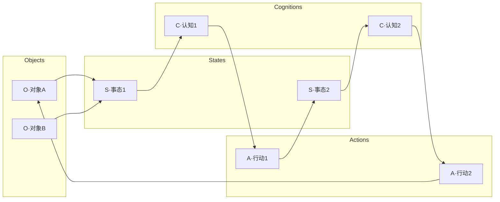
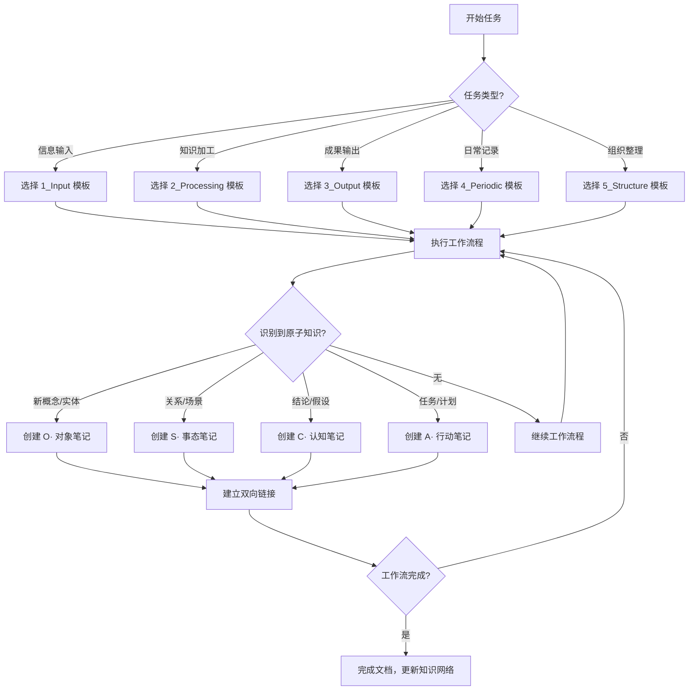
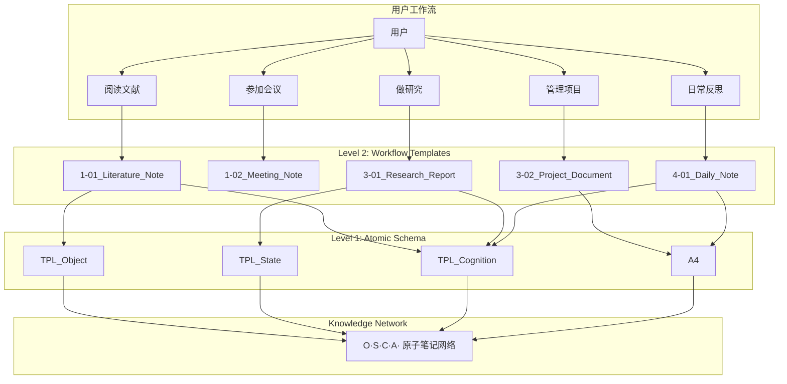

# KA 模板系统总览

> 统一入口：理解 KA 系统的两层模板架构

## 🎯 核心理念

KA 系统的模板分为两个层级，各司其职，协同工作：

```
┌─────────────────────────────────────────────────────┐
│  Level 2: Workflow 层（工作流文档模板）              │
│  位置: cognition/templates/                         │
│  职责: 引导完成认知任务，产出工作文档                 │
│  ─────────────────────────────────────              │
│  文献笔记 → 会议记录 → 研究报告 → 项目文档            │
│                    │                                │
│                    ▼ 产出/引用                       │
│  ─────────────────────────────────────              │
│  Level 1: Schema 层（原子笔记数据结构）              │
│  位置: action/knowledge-network/templates/          │
│  职责: 定义知识网络节点，沉淀原子知识                 │
│  ─────────────────────────────────────              │
│  O·对象 ↔ S·事态 ↔ C·认知 ↔ A·行动                  │
└─────────────────────────────────────────────────────┘
```

---

## 📐 设计原则

### 原子笔记核心原则（Level 1）

| 原则 | 说明 | 实现方式 |
|------|------|---------|
| **单一职责** | 一条笔记 = 一个清晰单位 | O/S/C/A 各自独立 |
| **单一来源** | 知识只在一处定义 | 通过 wikilinks 引用 |
| **可检验性** | 认知可证伪，行动可执行 | claim、steps、success |
| **强链路** | 明确上下游关系 | links 字段规范化 |
| **元数据驱动** | 支持查询和自动化 | YAML frontmatter |

### 工作流模板原则（Level 2）

| 原则 | 说明 | 实现方式 |
|------|------|---------|
| **流程引导** | 引导用户完成认知任务 | 章节结构化 |
| **原子产出** | 指导创建原子笔记 | "原子笔记产出"章节 |
| **聚合呈现** | 汇总原子笔记形成文档 | Dataview 查询 |
| **可交付** | 形成完整可分享的成果 | 结构完整性 |

---

## 🗂️ Level 1: 原子笔记 Schema

**位置**: `action/knowledge-network/templates/`

### 核心模板

| 模板 | 文件前缀 | 职责 | 关键字段 |
|------|---------|------|---------|
| [[action/knowledge-network/templates/TPL_Object|TPL_Object]] | `O·` | 对象/实体定义 | spec, interfaces |
| [[action/knowledge-network/templates/TPL_State|TPL_State]] | `S·` | 事态/场景快照 | window, observations |
| [[action/knowledge-network/templates/TPL_Cognition|TPL_Cognition]] | `C·` | 认知/结论/假设 | claim, evidence, uncertainty |
| [[action/knowledge-network/templates/TPL_Atomic_Generic|TPL_Atomic_Generic]] | 通用 | 快速创建原子笔记 | 基础结构 |

### 可视化辅助模板

| 模板                                                         | 用途           |          |
| ---------------------------------------------------------- | ------------ | -------- |
| [[action/knowledge-network/templates/TPL_Mermaid_Flowchart | Flowchart]]  | 流程图、因果关系 |
| [[action/knowledge-network/templates/TPL_Mermaid_Sequence  | Sequence]]   | 时序交互     |
| [[action/knowledge-network/templates/TPL_Mermaid_Timeline  | Timeline]]   | 时间线      |
| [[action/knowledge-network/templates/TPL_Mermaid_Gantt     | Gantt]]      | 排程甘特图    |
| [[action/knowledge-network/templates/TPL_Mermaid_Mindmap   | Mindmap]]    | 思维导图     |
| [[action/knowledge-network/templates/TPL_Mermaid_Class     | Class]]      | 类图/领域模型  |
| [[action/knowledge-network/templates/TPL_Mermaid_ER        | ER]]         | 实体关系图    |
| [[action/knowledge-network/templates/TPL_Excalidraw_Guide  | Excalidraw]] | 手绘草图     |

### 原子笔记关系网络



---

## 🗂️ Level 2: 工作流文档模板

**位置**: `cognition/templates/`

### 1_Input - 信息输入类
| 模板 | 职责 | 产出的原子笔记 |
|------|------|---------------|
| [[cognition/templates/1-01_Literature_Note_文献笔记|文献笔记]] | 书籍/论文阅读 | O·概念, C·观点 |
| [[cognition/templates/1-02_Meeting_Note_会议记录|会议记录]] | 会议内容记录 | A·任务, S·决策 |

### 2_Processing - 信息处理类
| 模板 | 职责 | 产出的原子笔记 |
|------|------|---------------|
| [[cognition/templates/2-01_Concept_Note_概念笔记|概念笔记]] | 概念提炼 | O·概念（→objects/）|
| [[cognition/templates/2-02_Knowledge_Note_知识笔记|知识笔记]] | 知识整理 | C·洞见, O·概念 |

### 3_Output - 成果输出类
| 模板 | 职责 | 产出的原子笔记 |
|------|------|---------------|
| [[cognition/templates/3-01_Research_Report_研究报告|研究报告]] | 研究性报告 | S·发现, C·结论, A·建议 |
| [[cognition/templates/3-02_Project_Document_项目文档|项目文档]] | 项目管理 | A·任务, S·里程碑 |

### 4_Periodic - 周期笔记类
| 模板 | 职责 | 产出的原子笔记 |
|------|------|---------------|
| [[4-02_Daily_Note_Summar_日记|日记]] | 每日记录 | A·任务, C·反思 |

### 5_Structure - 结构性工具
| 模板 | 职责 | 产出的原子笔记 |
|------|------|---------------|
| [[cognition/templates/5-01_MOC_内容地图|MOC]] | 知识地图 | 聚合所有类型 |

---

## 🔄 使用流程

### 标准工作流



### 快速参考

**何时创建原子笔记？**

| 场景 | 创建类型 | 示例 |
|------|---------|------|
| 发现新概念/术语/工具 | O·对象 | `O·React Hooks` |
| 观察到关系/现象/场景 | S·事态 | `S·路由器天线配置分析·20260119` |
| 形成可检验的结论 | C·认知 | `C·双天线设计提升信号稳定性` |
| 需要执行的任务/实验 | A·行动 | `A·天线配置测试·验证信号强度` |

---

## 📊 模板系统架构图



---

## 🔗 相关文档

### 架构与规范
- [[cognition/knowledge-network/02-schema|原子笔记：原则·类型·字段·链接规范]]
- [[action/knowledge-network/templates/README|模板系统说明]]
- [[cognition/templates/README|认知层模板系统 README]]
- [[cognition/templates/UPGRADE_GUIDE|模板系统升级指南]]

### KA 系统文档
- [[cognition/如何构建认知-行动系统|KA系统构建指南]]
- [[README|KA-Vault 项目概览]]

---

## ✅ 检查清单

### 创建原子笔记前
- [ ] 确认是单一职责（一条笔记 = 一个清晰单位）
- [ ] 检查是否已存在类似笔记（单一来源原则）
- [ ] 选择正确的类型（O/S/C/A）
- [ ] 准备好必要的链接关系

### 创建工作流文档前
- [ ] 选择适合任务类型的模板
- [ ] 了解该模板会产出哪些原子笔记
- [ ] 准备好相关的原子笔记链接

### 完成工作后
- [ ] 检查原子笔记产出章节
- [ ] 确保所有新知识都已沉淀为原子笔记
- [ ] 验证双向链接完整性
- [ ] 更新相关 MOC

---

**文档版本**: 1.0
**创建日期**: 2026-01-19
**维护者**: KA 系统

> 💡 这是 KA 模板系统的统一入口，建议收藏此页面以便快速访问
